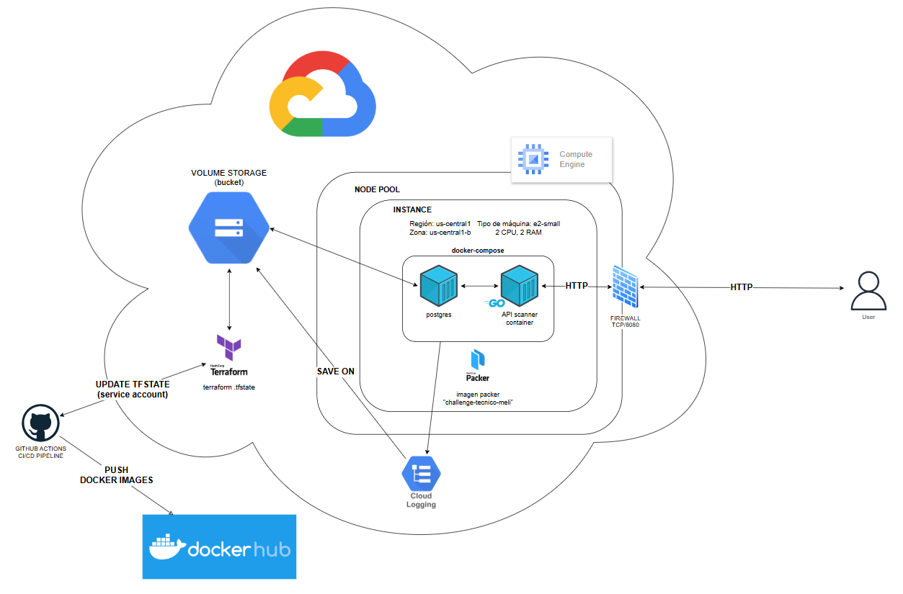

# Challenge Técnico MELI - Gonzalo Benito
Repositorio para el challenge técnico de MELI: "API para Detección de Vulnerabilidades en Imágenes de Contenedores"

## Solución propuesta
Para la solución, se utilizará el lenguaje Go con el framework Gin, junto a una base de datos postgresql (inicialmente usé sqlite para empezar a desarrollar rápido) para la persistencia. Para realizar el análisis de vulnerabilidades en las imágenes docker, se optó por el scanner Grype.

## Ejecución
```bash
# Git clone HTTP
git clone https://github.com/Guanart/challenge-tecnico-meli.git

# Git clone SSH
git clone git@github.com:Guanart/challenge-tecnico-meli.git

cp .env.example .env
docker compose up
```

## Funcionamiento
La API consta de 3 endpoints: 
1. POST /api/v1/images que permite indicar la imagen a analizar. Ejemplo:
    ```bash
    curl -X POST http://localhost:8080/api/v1/images -H "Content-Type: application/json" -d '{"name": "nginx"}'
    ```
2. GET /api/v1/images/ que lista las imágenes indexadas. Ejemplo:
    ```bash
    curl -X GET http://localhost:8080/api/v1/images
    ```
3. GET /api/v1/images/:name que permite obtener el listado de vulnerabilidades para una determinada imagen. Ejemplo:
    ```bash
    curl -X GET http://localhost:8080/api/v1/images/nginx
    ```

## Diagrama de arquitectura en la nube


## Posibles mejoras
- Hacer un refactor en connection.go: hacerlo orientado a objetos y evitar hardcodear el path de la BD (cargar el valor de un archivo de configuración e inyectarlo a una clase Conexión)
- Desacoplar del archivo main.go las funciones asociadas a cada ruta. Crear un controller o service.